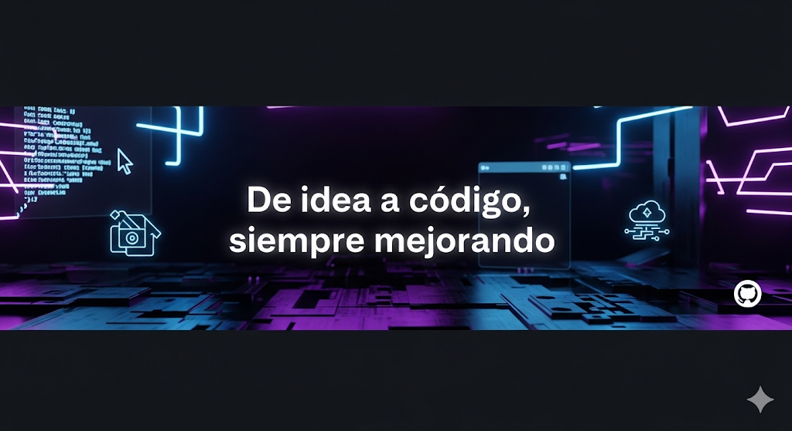
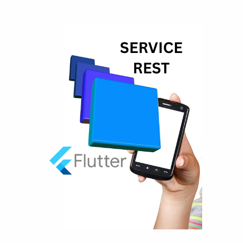
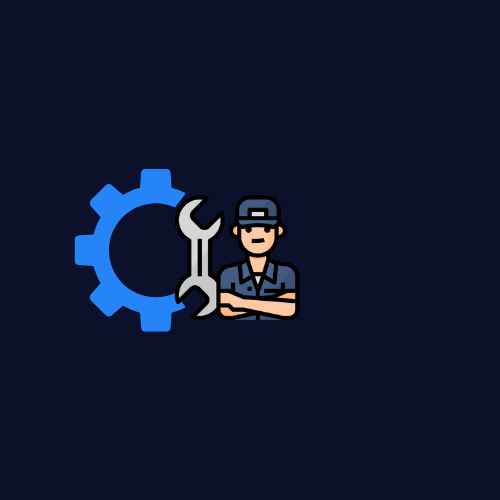
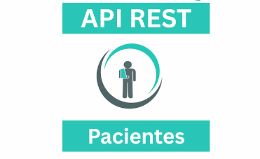
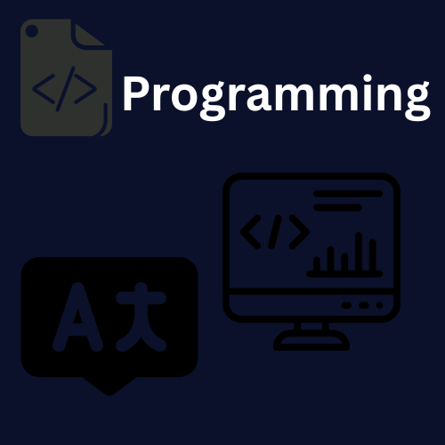
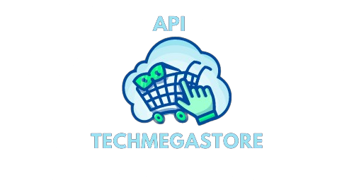
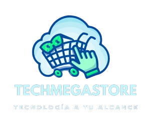

# Bienvenid@ a mi GitHub. Soy Marco A. Hernández, descubre mis proyectos y experiencia en programación.

### Redes Sociales 🌐

Hola, soy Marco Antonio, desarrollador apasionado por la programación y la tecnología. Creo en el trabajo en equipo para lograr resultados excepcionales y estoy siempre dispuesto a aprender y compartir conocimientos. Me comprometo con la mejora continua y busco constantemente nuevos desafíos para crecer profesionalmente.

## Tecnologías 💻

### Lenguajes & Frameworks

### Bases de datos

### Cloud & DevOps

### Herramientas & Gestión

<h2 align="center">Proyectos</h2>
  

  <!-- Proyecto 1 -->
  

    <h3>Proyecto App Movil CRUD Servicios Rest</h3>
    
    

      
    

    

      CRUD Serviciso Rest Push, Cámara, Mapas, REST API, SQLite, CRUD, Tokens, Storage, Preferencias de usuario, Bloc y más!
    

  

  <!-- Proyecto 2 -->
  

    <h3>Proyecto BackEnd TokesMagistralService</h3>
    
    

      
    

    

      Aplicación de servicios mecánicos automotrices <strong>diseñada con microservicios.</strong> Gestión de usuarios, clientes y vehículos con <strong>CRUD vía Web API en .NET Core</strong>. Seguridad mediante JWT.
    

  

  <!-- Proyecto 3 -->
  

    <h3>Proyecto BackEnd ApiRest Pacientes</h3>
    
    

      
    

    

      Proyecto creado con Node.js y Express sobre SQLite, que permite crear, visualizar, editar y eliminar pacientes. Utiliza EJS en el frontend y backend siguiendo arquitectura MVC.
    

  

  <!-- Proyecto 4 -->
  

    <h3>Retos Lógica POO</h3>
    
    

      
    

    

      Retos para mejorar la lógica de programación, <strong>implementados en C# y POO.</strong>
    

  

  <!-- Proyecto 5 -->
  

    <h3>Proyecto BackEnd TechMegaStore</h3>
    
    

      
    

    

      Gestión y venta de aparatos tecnológicos con microservicios en .NET 8. Seguridad, experiencia personalizada y operación eficiente.
    

  

  <!-- Proyecto 6 -->
  

    <h3>Proyecto FrontEnd TechMegaStore</h3>
    
    

      
    

    

      Sistema de ventas en Angular y TypeScript con interfaz dinámica y funcionalidades completas para la gestión de ventas.
    

  

